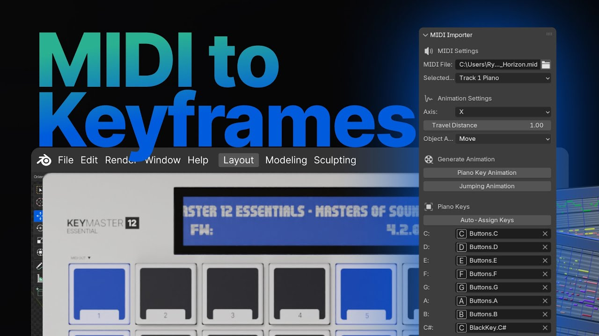

[Example of plugin generating keyframes with 3D piano keys](https://github.com/user-attachments/assets/dc90301c-569a-493f-a6f9-35798aeb086b)

[](https://whoisryosuke.github.io/blender-midi-motion/)

# MIDI Motion Blender addon

This is a free Blender addon to import MIDI files and generate animations using keyframes or actions. It assigns the animations to objects you assign as piano keys.

You can animate piano keys using rotation, buttons using movement, or get more creative with any object using the scale.

# Features:

- 🎹 Assign objects as "piano keys"
- 📈 Generate animations keyframes when note is pressed
- ⚙️ Generate actions when note is pressed
- 🎼 Select MIDI track
- 🎵 Select octave (or condense all)
- 🐇 Change animation type (move, rotate, or scale)
- 📏 Change animation parameters (distance, axis)
- 🔎 Automatically assign piano keys using selected collection

**Coming Soon:**

- “Jumping between keys” animation

## ⬇️ Installation

1. [Download the plugin zip](https://github.com/whoisryosuke/blender-midi-keyframes/releases/download/latest/midi_motion-0.0.7.zip)
1. Open Blender
1. Go to Edit > Preferences and go to the Addons tab on left.
1. Click install button.
1. Select the zip you downloaded.
1. You can confirm it's installed by searching for **"MIDI Motion"** and seeing if it's checked off

> If you still have MIDI to Keyframes installed, you can remove it. MIDI Motion is the newer version of that plugin.

## 🎥 Tutorial

Here's [a video walkthrough](https://www.youtube.com/watch?v=E4wfblQWhtY) of the plugin and it's major features (up to `v0.0.5`):

[](https://www.youtube.com/watch?v=E4wfblQWhtY)

## 🔰 How to use

Check out [our documentation website](https://whoisryosuke.github.io/blender-midi-motion/docs/getting-started) for guides, tips, and resources.

## ⚙️ How it works

I did [a full breakdown on my blog here](https://whoisryosuke.com/blog/2024/midi-powered-animations-in-blender) that covers the creation of the plugin and tips and tricks for working with MIDI in Python.

## Development

1. Clone the repo: `git clone`
1. Zip up the folder.
1. Install in Blender.
1. Open the plugin code inside your Blender plugin folder.
1. Edit, Save, Repeat.

## Publish

1. Bump version in `__init__.py`
1. Bump version in `blender_manifest.toml`
1. `blender --command extension build --output-dir dist`
1. Upload the new `.zip` file generated inside `/dist` folder to [GitHub Releases page](https://github.com/whoisryosuke/blender-midi-keyframes/releases/new).
1. Update the `README.md` Installation instructions with the new URL to the release ZIP.

> On Windows? You can add `blender` to your command line by going to Start annd searching for "Edit Environment Variables for your account". Find the Variable "PATH" and edit it. Add the full path to where your `blender.exe` is located (e.g. `C:/Program Files/Blender/4.2/`).

### Dependencies

We basically have Python PIP "wheel" files that contain dependencies we need for this addon. The manifest installs them for us. Running the build command just zips up the folder with the version name attached - nothing fancy.

If you want to update the dependencies, run these commands and then update the `blender_manifest.toml` with any new `.whl` filenames:

```shell
pip download mido --dest ./wheels --only-binary=:all: --python-version=3.11 --platform=macosx_11_0_arm64
pip download mido --dest ./wheels --only-binary=:all: --python-version=3.11 --platform=manylinux_2_28_x86_64
pip download mido --dest ./wheels --only-binary=:all: --python-version=3.11 --platform=win_amd64
```

> Read more about [the extension setup here](https://docs.blender.org/manual/en/dev/advanced/extensions/getting_started.html) and [build process here](https://docs.blender.org/manual/en/dev/advanced/command_line/extension_arguments.html#command-line-args-extension-build).

## 💪 Credits

- [mido](https://github.com/mido/mido)
- [Gamepad Input Blender addon](https://github.com/whoisryosuke/blender-gamepad)
