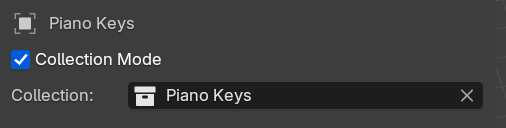
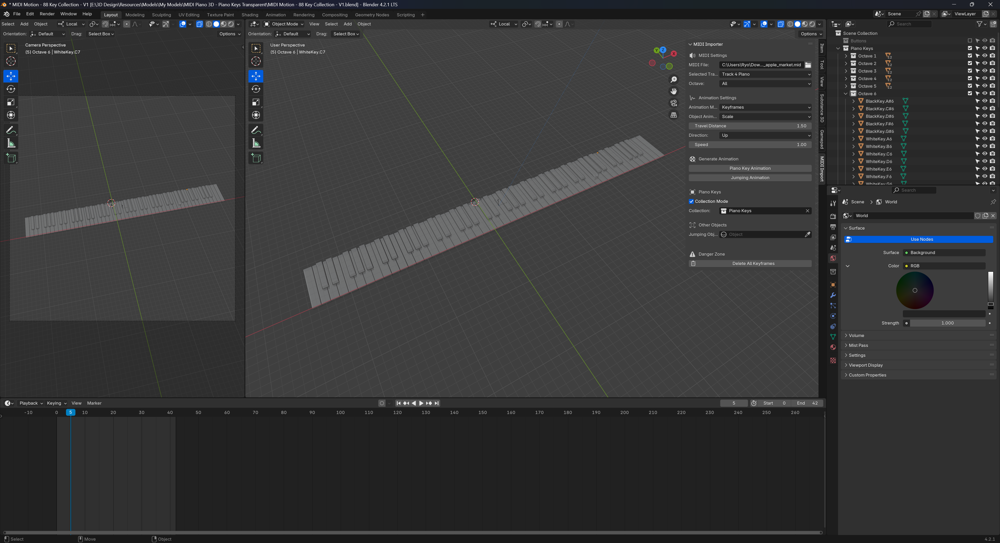

# Collection Mode

By default we only target 12 keys at a time. But what if you want to animate a wider set of keys - like say - **a full _88-key_ piano**? That's where **Collection Mode** comes in.

By checking the Collection Mode box, the 12 object selection input fields get replaced with a single collection selection field. If you assign a collection, the plugin will search inside for any object that matches the proper piano key.

For example, if the note `F6` is pressed, the plugin will search for an object with a name suffixed with that. So it'd ideally find something like `WhiteKey.F6` or `MyObject.001.F6`.

The plugin will do this for all notes in the MIDI file. If no object is found for a specific note, it won't animate and keep going to the next note.

## Using Collection Mode

1. Setup your file with as many objects as piano keys you want. For example, for a full piano, you'll want 88 objects.
1. Place all the objects in a single collection.
1. Name each object with a piano note at the end (e.g. `C4`, `C5`, `D#5`)
1. Open up the plugin panel.
1. Make sure **Collection Mode** is enabled.
1. In the collection input field, find the collection your made earlier.
1. Change the animation settings as needed (like rotation vs movement, or the distance).
1. Click **Piano Key Animation** when ready to generate the animation.

Done! Select one of your piano keys to see if it has animation keyframes.

## Example file

To make things easier, we have an example Blender file with an 88-key piano with all the objects named properly.

[You can download it here.](https://github.com/whoisryosuke/blender-midi-motion/tree/main/examples/MIDI Motion - 88 Key Collection - V1.blend)

Here's how to use it:

1. Open the Blender file.
1. Open the MIDI plugin panel if it's not already open
1. Select a MIDI file and change the animation settings to your liking.
1. Change to collection mode if not already.
1. Select the Piano Keys collection.
1. Click **Piano Key Animation** when ready to generate the animation.

The piano keys should be animated, play the animation or select one of them to confirm it has keyframes.

There's a camera setup in the scene that's focused on the keyboard, so you can move it around anywhere and keep it in view. The only thing missing is some good lighting, I'd recommend downloading an HDR and just using that.

## Naming objects

The plugin searches for objects inside your selected collection with the note name at the end. For example, `C#4` would search for objects like `Whatever.C#4` or `Cube.001.C#4`.

The plugin searches all objects inside the collection, even if they're nested inside other collections or parented to other objects.

Here's an example of a working setup where we have a collection called **"Piano Keys"** that contains other collections with sets of piano keys representing octaves:

![Blender's Outliner with a collection called Piano Keys containing a list of objects named WhiteKey and BlackKey with note names appended to the end.]

## Deleting keyframes

The **Delete All Keyframes** button will delete all animations inside your collection. It **only deletes from objects with piano key names**, so you won't lose animations on any other objects.
