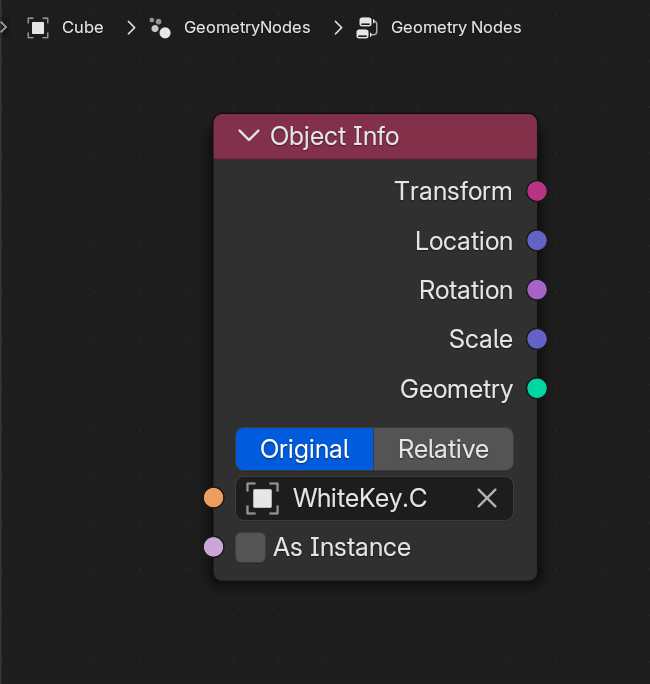

# Geometry Nodes

If you want to use the MIDI animation data inside geometry nodes, you can just use the plugin to animate objects -- then import those into geometry nodes.

Depending on how you animated your object, you can use the data in your geometry nodes. For example, if your object moves up and down, you can use the `Location` output of the Object Info node to check if the object is up or down.

## Custom Node Group

To simplify the process, I usually create a custom geometry node group that encapulates this logic and lets me select other keys quickly.

I export a couple of values to make animating easier. A **"pressed"** `float` that goes from `0` to `1`, where `1` means pressed. I also export a `boolean` version for quick use.

:::info

You'll notice I also assign a Custom Attribute with the pressed value. This is useful if you want to animate your materials and keep them synced to the MIDI.

:::

## Empty Objects

If you plan on exclusively using geometry nodes, I recommend on using Empty objects as your piano keys.

You create 12 (or more) empty objects, assign them as piano keys in the plugin and generate an animation. Then you import each of these empty objects into a geometry node graph (as an Object Info node), and you can use the object's data to determine if it's pressed or not.

This way you don't have to worry about having extra meshes in the scene to hide or keep track of.

## Examples

### Particles

It's very easy to spawn particles when a MIDI key is pressed. We use the custom node group from above to detect key presses on an object, and spawn new objects when we detect it's pressed.

You could use this technique to create VFX for key presses to enhance a piano scene - or just get creative and go wild.
