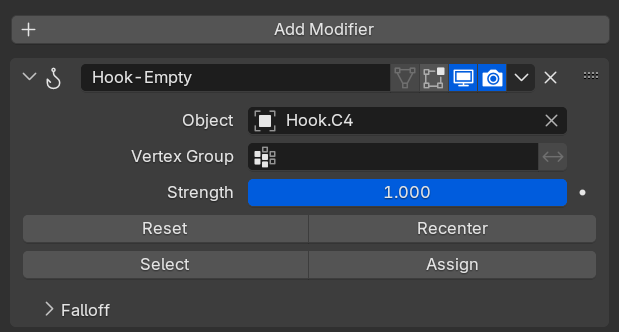
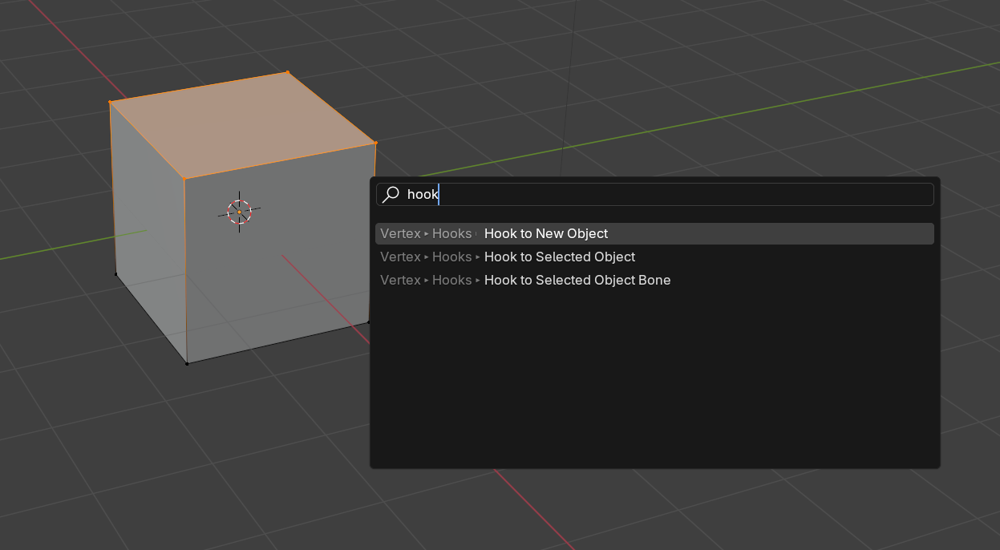

# Using Hooks

When you're animating, you usually just select an mesh (like a 3D piano key). But what if you want to control part of a mesh - like taking one part of it and making it the "C" key, and another part and making it the "D" key?

That's where Blender's Hook modifier comes into play. You can add a Hook modifier to your object, select what vertices should be controlled by the "hook", then assign another object that acts as a "controller". This lets you take the part of the mesh you selected and control it's position using another object.

You can also just select the mesh, go into Edit mode, select the vertices you want to control, then use the search to find "Hook to new object". This will automatically create a new Empty object, add the Hook modifier to your object, and wire up the Empty to the hook modifier.

## Why use hooks?

To give you a practical example: I wanted to make a piano that animates it's curve (bending up and down) - but also have the piano keys animating with the MIDI playback.

To accomplish this, I merged all my piano keys into 1 mesh/object -- then I selected each key individually and assigned a separate hook modifier for each one. By the end I had 12 hooks (7 white, 5 black piano keys).

<Bluesky id="3lirtdfcdlt2k" />
