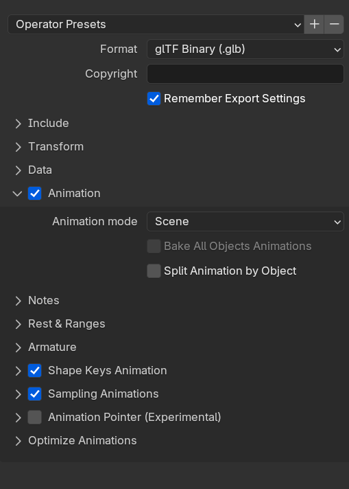

# Exporting Animation

To export the animation, we recommend using a GLTF file (`.gltf` or `.glb`) to store your mesh and animation data together.

You can export anytime after you click **"Generate keyframes"** or **"Generate actions"**. You should be able to see keyframes or actions in your timeline.

## Exporting from Blender

1. Open your Blender file with a MIDI animation as keyframes or actions
1. Select any objects you want included in the GLTF file
1. Go to File > Export > GLTF on the top left menu bar.
1. Check the toggle labeled **Animation** if it already isn't
1. Expand the Animation toggle
1. Change the **Animation Mode** to **Scene**
1. Uncheck **"Split Animation by Object"**

### Common mistakes

- If you don't uncheck **"Split Animation by Object"**, it will generate an animation track for each object that has animation (like each "piano key"). This will give you headaches in game engines like Godot and Unreal. This works ok if you want to animate one key independently - but if you want a full performance it'll be difficult to play and synchronize all clips together.
- If you don't change the **"Animation Mode"** to **Scene** - you likely won't see any animations when you export or empty animation tracks.
