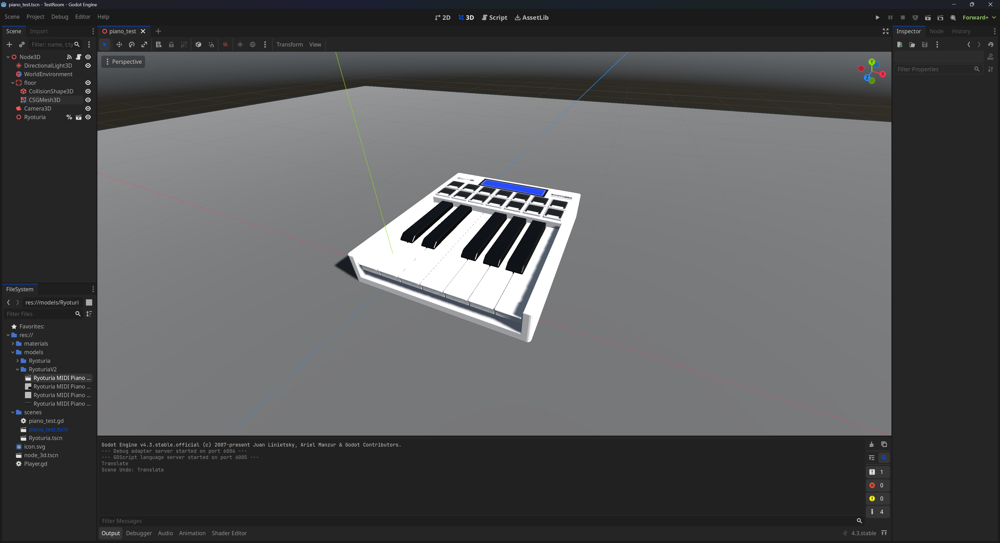

# Exporting to Godot

For Godot we recommend using a GLTF file (`.gltf` or `.glb`) to store your mesh and animation data together. Check out [our guide here](./export.mdx) on how to save your animation to GLTF in Blender.



## Importing Animation

1. Open an existing project
2. Drag and drop the GLTF file inside the FileSystem panel (preferably in a folder you want it)
3. Accept the defaults
4. Drag and drop the GLTF node into your scene (looks like a movie clip icon).

## Playing the Animation

To play the animation, create a script on a node anywhere in the scene (I just picked the top-most scene node).

You can play the animation whenever you want (like say - when a player activates it), but I’ll be playing it here when the level loads immediately using the `on_ready()` Node method. You can attach this method to your script by navigating to the Node panel (the tab next to Inspector in the right sidebar by default) and right clicking the `ready()` method and picking **"Connect".**

```python
extends Node3D

# Runs when the level loads
func _on_ready() -> void:
	# Sanity check
	#print("running")

	# Grab the GLTF model. I made it a "Unique Name"
	var animation_player = %Ryoturia.get_node("AnimationPlayer") as AnimationPlayer

	# Play the animation, usually labeled "Scene"
	# You can open the GLTF node and check the name inside the AnimationPlayer
	animation_player.play("Scene")

	pass
```

:::info

You'll notice I access the GLTF mesh by using the `%Ryoturia` variable. This is a Godot feature where you can right click any node/object in the scene tree and select **"Make Unique Name"** to quickly access it in code. The alternative would be to use `get_node()` with the node name (similar to how we access the `AnimationPlayer`)

:::
