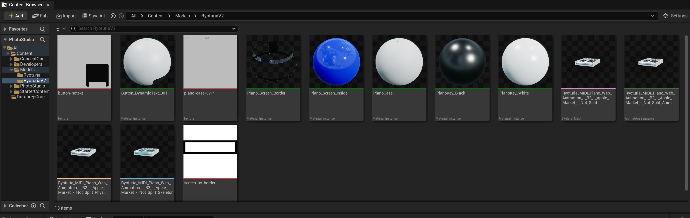
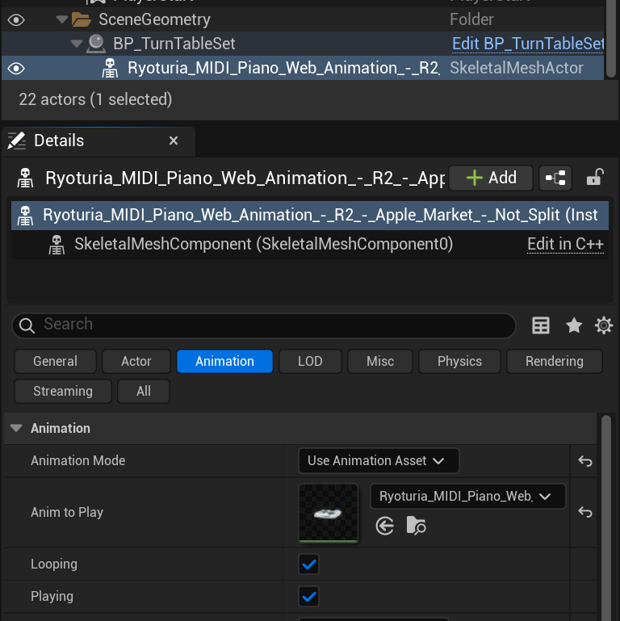

# Exporting to Unreal Engine

For Unreal Engine we recommend using a GLTF file (`.gltf` or `.glb`) to store your mesh and animation data together. Check out [our guide here](./export.mdx) on how to save your animation to GLTF in Blender.

## Importing Animation

1. Drag and drop GLTF file into Unreal project in the Content Browser panel
2. Accept the default settings
3. You should see the folder populate with the textures from your mesh, a Skeletal Mesh, an Animation Sequence, a Physics Mesh, and another Skeletal Mesh
4. Drag the first Skeletal Mesh into your scene.

:::info

I used the Photo Studio template Unreal Engine 5 provides by default as a nice pre-lit turn table to show off the piano.

:::

## Playing Animation

To play the animation:

1. Select the skeletal mesh we imported into the scene and go to the property panel
2. Change Animation Mode to “Use Animation Asset”
3. Select the “Anim to Play” from the dropdown. There should only be one.
4. The animation should autoplay when you start the game.

