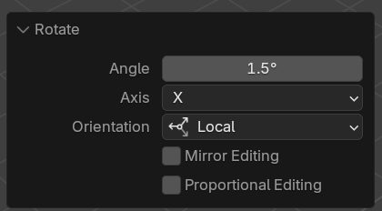

# Keyframes

With keyframe animation, we basically mimic a "key press" by moving/rotating/scaling the object from one state to another (like up and down). This is the default mode for the plugin.

## Using Keyframes

1. Import a MIDI file and pick your track.
1. Change the **Animation Mode** to **Keyframes** if it's not already set. You might notice the plugin UI change and swap things out.
1. Change the **Object Animation** to your desired animation type - **Move**, **Rotate**, or **Scale**.

   - **Move:** This moves the object "up and down" in 3D space - based on the Axis (X, Y, Z) and Distance you pick. Z and Down are usually to go-to for a button-like press.
   - **Rotate:** This rotates the object in 3D space - based on the Axis (X, Y, Z) and Distance you pick. X and Up are usually to go-to for a piano-like press. Up represents a "negative" rotation, Down represents a "positive" rotation.
   - **Scale:** This scales the object bigger in 3D space. The "Travel Distance" represents the number your object will scale to from it's starting scale.

   I suggest moving, rotating, or scaling your object how you want it to animate. Then look at the bottom left corner of your Blender 3D viewport and it should popup with a box that tells you what Axis and "distance" you just moved the object. Then you can copy those values into the plugin.

   

1. You can also control the speed of your animation if you want to speed or slow it down for any reason.
1. Assign your "piano key" objects.
1. Click **"Generate Keyframes"**

You should have an animation! Click play to preview it.

Or select one of your "piano key" objects that gets pressed and check the **Timeline** panel for keyframes. Make sure you check an object representing a note that actually gets pressed, since not all notes are pressed in every song.
