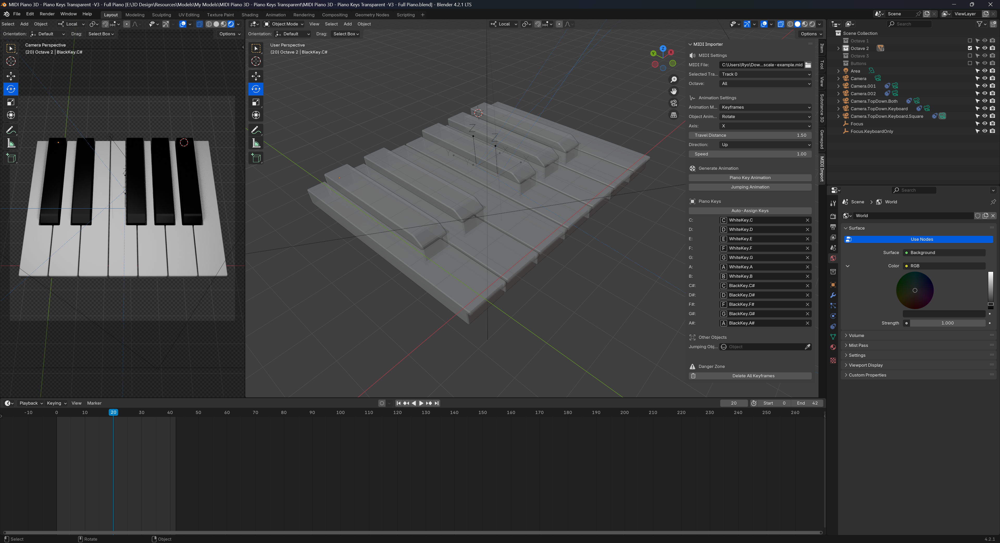

# Example Files

To help you get started faster with the plugin we have a few example Blender files you can download. These show how to setup a single set of piano keys, as well as additional keys (like drum pads from a MIDI pad).

## 3D Example

You [download this example here on GitHub](https://github.com/whoisryosuke/blender-midi-keyframes/blob/main/examples/MIDI%20Piano%203D%20-%20Piano%20Keys%20Transparent%20-V3%20-%20Full%20Piano.blend) and you can [see an example animation using this template here](https://bsky.app/profile/whoisryosuke.bsky.social/post/3l4tnxht6rj2c).

<Bluesky id="3l4tnxht6rj2c" />

## 2D Example

You [download this example here on GitHub](https://github.com/whoisryosuke/blender-midi-keyframes/blob/main/examples/MIDI%20to%20Keyframe%20-%202D%20Style%20-%20TEMPLATE%20-%20V1.blend) and you can [see an example animation using this template here](https://bsky.app/profile/whoisryosuke.bsky.social/post/3l4ekfigp6g2w).

<Bluesky id="3l4ekfigp6g2w" />
