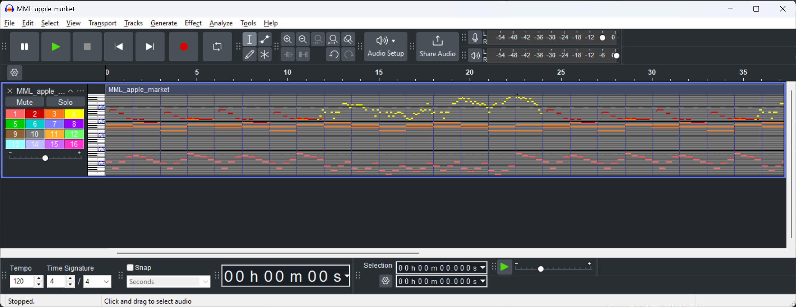

I'd recommend downloading the free open-source app, [Audacity](https://www.audacityteam.org/), to visualize the MIDI tracks and see what the note charts look like before you import them into Blender.

